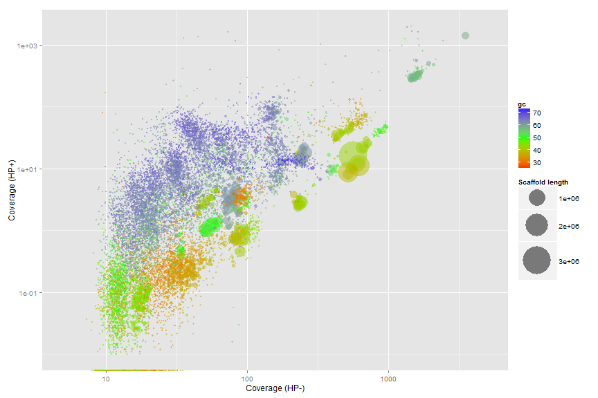
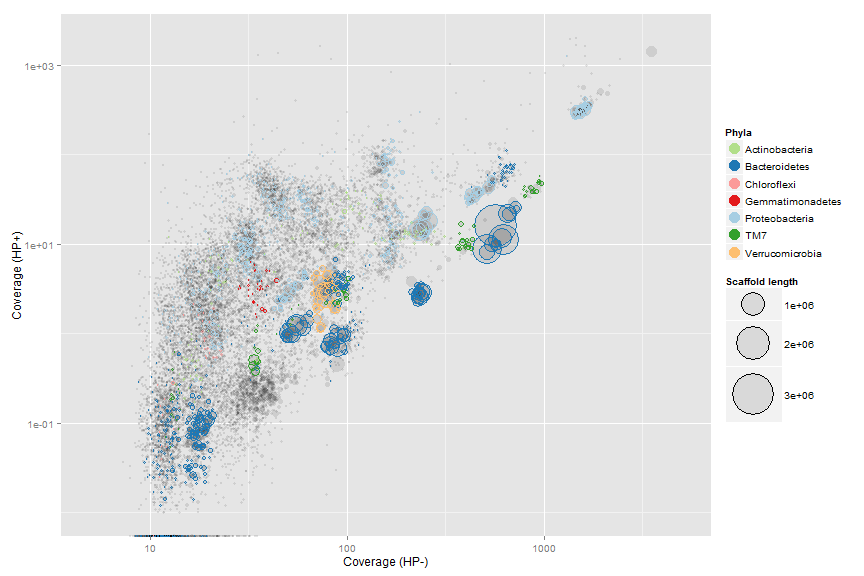
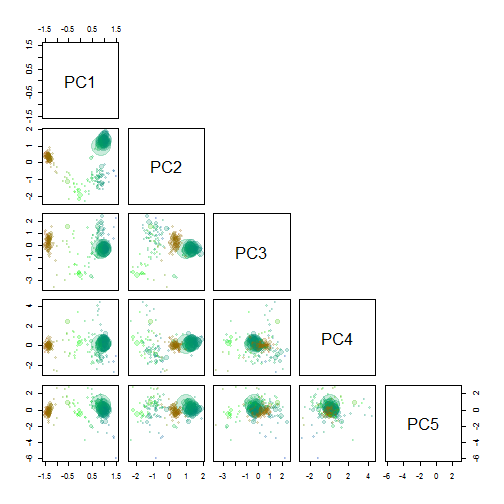
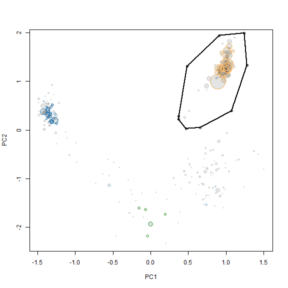

Metagenome R workflow version 1.1
========================================================

## Introduction
This R tutorial show how to extract individual genome bins from metagenomes, as descibed in Albertsen et al., 2013 (Add link). The guide is written in R markdown and can be found [HERE](https://github.com/MadsAlbertsen/multi-metagenome/tree/master/R.data.generation).

The basic requirement is two metagenomes where the target species are in differential abundance. The data is assembled into 1 assembly (i.e a collection of scaffolds). The raw reads are then mapped independently to the assembly, which generates two coverage estimates for each scaffold.

The guide uses the original data from the publication.

***

### Download the R formatted data.

Download and upack the data used in Albertsen et al., 2013. The file is approximately 70 Mb.


```r
#
# download.file('https://dl.dropbox.com/s/989dix16ugyuvrq/Albertsen2013.data.tar.gz',
# 'Albertsen2013.data.tar.gz') untar('Albertsen2013.data.tar.gz')
```


***
### Load needed packages

In case you havn't install all the needed packages, they can be installed via e.g. **install.packages('vegan')**.


```r
R.version$version.string
```

```
## [1] "R version 3.0.0 (2013-04-03)"
```


```r
library("vegan")
library("plyr")
library(RColorBrewer)
library(alphahull)
library(ggplot2)
```


***
### Read in all the data

All data except the two coverage estimates (**HPminus**, **HPplus**) can be automatically generated from a fasta file of the assembled scaffolds using the script: **workflow.R.data.generation.sh**. Coverage estimates for the scaffolds can be obtained through most short read mappers.


```r
HPminus <- read.csv("HPminus.scaffold.coverage.csv", header = T)
HPplus <- read.csv("HPplus.scaffold.coverage.csv", header = T)
gc <- read.delim("assembly.gc.tab", header = T)
kmer <- read.delim("assembly.kmer.tab", header = T)
ess <- read.table("assembly.orfs.hmm.id.txt", header = F)
ess.tax <- read.delim("assembly.orfs.hmm.blast.tax.tab", header = F)
cons.tax <- read.delim("assembly.tax.consensus.txt", header = T)

colnames(kmer)[1] = "name"
colnames(ess) = c("name", "orf", "hmm.id")
colnames(ess.tax) = c("name", "orf", "phylum")
colnames(cons.tax) = c("name", "phylum", "tax.color", "all.assignments")
```


Merge all data on scaffolds into a single data frame **d**.


```r
d <- as.data.frame(cbind(HPminus$Name, HPplus$Reference.length, gc$gc, HPminus$Average.coverage, 
    HPplus$Average.coverage), row.names = F)
colnames(d) = c("name", "length", "gc", "HPminus", "HPplus")
d <- merge(d, cons.tax, by = "name", all = T)
```


Clean up phylum names.


```r
d$phylum <- sub("<phylum>", "", d$phylum)
d$phylum <- sub("unclassified Bacteria", "TM7", d$phylum)
d$phylum <- sub("/Chlorobi group", "", d$phylum)
d$phylum <- sub("Chlamydiae/", "", d$phylum)
d$phylum <- sub(" group", "", d$phylum)
d$phylum <- sub("Amoebozoa", NA, d$phylum)
d$phylum <- sub("Opisthokonta", NA, d$phylum)
```


Merge all data on essential genes into a single data frame **e**.


```r
e <- merge(ess, d, by = "name", all.x = T)
e <- merge(e, ess.tax, by = c("name", "orf"), all.x = T)
```


***

### Define a few functions for later use

Calculate basic statistics on a set of scaffolds.


```r
genome.stats <- matrix(NA, nrow = 0, ncol = 9)
colnames(genome.stats) <- c("total.length", "# scaffolds", "mean.length", "max.length", 
    "gc", "HPminus", "HPplus", "tot.ess", "uni.ess")

calc.genome.stats <- function(x, y) matrix(c(sum(x$length), nrow(x), round(mean(x$length), 
    1), max(x$length), round(sum((x$gc * x$length))/sum(x$length), 1), round(sum((x$HPminus * 
    x$length))/sum(x$length), 1), round(sum((x$HPplus * x$length))/sum(x$length), 
    1), nrow(y), length(unique(y$hmm.id))), dimnames = list(colnames(genome.stats), 
    ""))
```


Extract a subset of scaffolds.


```r
extract <- function(x, a.def, v1, v2) {
    out <- {
    }
    for (i in 1:nrow(x)) {
        if (inahull(a.def, c(v1[i], v2[i]))) 
            out <- rbind(out, x[i, ])
    }
    return(out)
}
```


***

## Initial overview of the data


```r
calc.genome.stats(d, e)
```

```
##                       
## total.length 4.231e+08
## # scaffolds  1.339e+05
## mean.length  3.159e+03
## max.length   3.049e+06
## gc           5.460e+01
## HPminus      8.270e+01
## HPplus       2.460e+01
## tot.ess      8.311e+03
## uni.ess      1.080e+02
```


To get an initial overview of the data we only use scaffolds > 5000 bp.


```r
ds <- subset(d, length > 5000)
es <- subset(e, length > 5000)
```


### Coverage plots - Colored by GC


```r
ggplot(ds, aes(x = HPminus, y = HPplus, color = gc, size = length)) + scale_x_log10(limits = c(5, 
    5000)) + scale_y_log10(limits = c(0.01, 2000)) + xlab("Coverage (HP-)") + 
    ylab("Coverage (HP+)") + geom_point(alpha = 0.5) + scale_size_area(name = "Scaffold length", 
    max_size = 20) + scale_colour_gradientn(colours = c("red", "green", "blue"))
```

 


### Coverage plots - Colored by phylum level assignment of essential genes

Use the tax.color variable to only color scaffolds from the 7 most abundant phyla. The tax.color variable is sorted by abundance. E.g. tax.color = 1 is assigned to the phyla with most scaffolds assigned. Change the **t** parameter to include more or less phyla.


```r
t <- 8
ds$tax.color[is.na(ds$tax.color)] <- 0
for (i in 1:nrow(ds)) {
    if (as.integer(ds$tax.color[i]) < t & as.integer(ds$tax.color[i]) > 0) {
        ds$tax.color[i] <- brewer.pal(8, "Paired")[as.integer(ds$tax.color[i])]
    } else {
        ds$tax.color[i] <- NA
        ds$phylum[i] <- NA
    }
}

pcol <- cbind(unique(ds$tax.color)[-1], unique(ds$phylum)[-1])
pcol <- pcol[order(pcol[, 2]), 1]
```


```r
ggplot(ds, aes(x = HPminus, y = HPplus, size = length, colour = phylum)) + scale_x_log10(limits = c(5, 
    5000)) + scale_y_log10(limits = c(0.01, 2000)) + xlab("Coverage (HP-)") + 
    ylab("Coverage (HP+)") + geom_point(alpha = 0.1, colour = "black") + geom_point(shape = 1) + 
    scale_colour_manual(name = "Phyla", values = pcol) + scale_size_area(name = "Scaffold length", 
    max_size = 20) + guides(colour = guide_legend(override.aes = list(alpha = 1, 
    size = 5, shape = 19)))
```

 


***

## Genome extraction
First zoom on a target genome - here the Verrumicrobia. Use the scaffolds with essential genes as a rough guide for selection of a subset of scaffolds that include the target genome. The non-target scaffolds will be removed in the next step. The locater function is used to interactively define a subspace on the plot. As locater is interactive - I've added the points maunally to allow recration of the full guide. The area defined by the selected points is extracted using the ahull function. 


```r
x <- "HPminus"
y <- "HPplus"

plot(ds[, x], ds[, y], log = "xy", cex = sqrt(ds$length)/100, pch = 20, col = rgb(0, 
    0, 0, 0.1), xlim = c(55, 110), ylim = c(0.5, 10), xlab = "Coverage HP-", 
    ylab = "Coverage HP+")

points(ds[, x], ds[, y], cex = sqrt(ds$length)/100 * 0.7, col = ds$tax.color, 
    lwd = 2)

# def<-locator(100, type='p', pch=20)

def <- {
}
def$x <- c(64, 66, 81, 92, 94, 81, 68, 65)
def$y <- c(2, 6.6, 7.7, 3.9, 1.4, 1, 1, 1.4)

g1.selection.A <- ahull(def, alpha = 1e+05)

plot(g1.selection.A, col = "black", add = T)
```

 


Extract all scaffolds and information on essential genes within the defined subspace using the **extract** function.


```r
g1.s.A <- extract(ds, g1.selection.A, ds[, x], ds[, y])
g1.e.A <- extract(es, g1.selection.A, es[, x], es[, y])
```


See the basic statistics of the selected scaffolds.


```r
calc.genome.stats(g1.s.A, g1.e.A)
```

```
##                       
## total.length 9801161.0
## # scaffolds      228.0
## mean.length    42987.5
## max.length    701203.0
## gc                54.9
## HPminus           79.1
## HPplus             3.2
## tot.ess          161.0
## uni.ess          104.0
```


Which of the single copy genes are duplicated? Note that some genomes might have duplicates of some "single copy genes".


```r
g1.d.A <- g1.e.A[which(duplicated(g1.e.A$hmm.id) | duplicated(g1.e.A$hmm.id, 
    fromLast = TRUE)), ]
head(g1.d.A[order(g1.d.A$hmm.id), c(1, 3, 8)])
```

```
##       name     hmm.id        phylum.x
## 2123  1820 PF00162.14 Verrucomicrobia
## 4599  3996 PF00162.14             TM7
## 1322  1328 PF00380.14 Verrucomicrobia
## 5090  4623 PF00380.14             TM7
## 1611 14624 PF00411.14 Verrucomicrobia
## 5095  4623 PF00411.14             TM7
```


As there is multiple genomes in the subset we make a PCA on the scaffolds in the subset.


```r
rda <- rda(kmer[g1.s.A$name, 2:ncol(kmer)], scale = T)
scores <- scores(rda, choices = 1:5)$sites

g1.s.B <- cbind(g1.s.A, scores)
g1.e.B <- merge(g1.e.A, g1.s.B[, c(1, 9:13)], all.x = T, by = "name")
g1.d.B <- merge(g1.d.A, g1.s.B[, c(1, 9:13)], all.x = T, by = "name")
```


We use the pairs function to plot the first 5 components.


```r
rgb.c <- colorRampPalette(c("red", "green", "blue"))
rgb.a <- adjustcolor(rgb.c(max(d$gc) - min(d$gc)), alpha.f = 0.2)
palette(rgb.a)

pairs(g1.s.B[, 9:13], upper.panel = NULL, col = g1.s.B$gc - min(d$gc), cex = sqrt(g1.s.B$length)/100, 
    pch = 20)
```

 


PC1 and PC2 seem to seperate our target genome from the other scaffolds and is therefore used for another extraction using the locator function.


```r
x <- "PC1"
y <- "PC2"

plot(g1.s.B[, x], g1.s.B[, y], cex = sqrt(g1.s.B$length)/100, pch = 20, col = rgb(0, 
    0, 0, 0.1), xlab = x, ylab = y)

points(g1.s.B[, x], g1.s.B[, y], cex = sqrt(g1.s.B$length)/100 * 0.7, col = g1.s.B$tax.color, 
    lwd = 1)

# def<-locator(100, type='p', pch=20)

def <- {
}
def$x <- c(0.3740306, 0.4839196, 0.9084907, 1.2431527, 1.2781173, 1.0733242, 
    0.653748, 0.4689347, 0.3690356)
def$y <- c(0.2810738, 1.31294166, 1.94015545, 1.99073721, 1.33317436, 0.39235367, 
    0.04839772, 0.02816501, 0.22037569)

g1.selection.B <- ahull(def, alpha = 1e+05)

plot(g1.selection.B, col = "black", add = T)
```

 


Again the **extract** function is used to retrive the scaffolds in the selected subset.


```r
g1.s.C <- extract(g1.s.B, g1.selection.B, g1.s.B[, x], g1.s.B[, y])
g1.e.C <- extract(g1.e.B, g1.selection.B, g1.e.B[, x], g1.e.B[, y])
```


See the basic statistics of the selected scaffolds.


```r
calc.genome.stats(g1.s.C, g1.e.C)
```

```
##                       
## total.length 6823444.0
## # scaffolds       59.0
## mean.length   115651.6
## max.length    701203.0
## gc                60.9
## HPminus           77.4
## HPplus             3.0
## tot.ess          106.0
## uni.ess          103.0
```


There are a few duplicated "single copy genes" however in this case it is not due to mulitple species in the bin, but real duplicates in the genome.


```r
g1.d.C <- g1.e.C[which(duplicated(g1.e.C$hmm.id) | duplicated(g1.e.C$hmm.id, 
    fromLast = TRUE)), ]
head(g1.d.C[order(g1.d.C$hmm.id), c(1, 3, 8)])
```

```
##     name     hmm.id        phylum.x
## 42   735 PF01795.14 Verrucomicrobia
## 79  2546 PF01795.14 Verrucomicrobia
## 80  2546 PF01795.14 Verrucomicrobia
## 139 5388 PF01795.14 Verrucomicrobia
```


Add the genome statistics to a list and print the name of the scaffolds to a file for further refinement.


```r
genome.stats <- rbind(genome.stats, t(calc.genome.stats(g1.s.C, g1.e.C)))
rownames(genome.stats)[nrow(genome.stats)] <- "genome 1"
show(genome.stats)
```

```
##          total.length # scaffolds mean.length max.length   gc HPminus
## genome 1      6823444          59      115652     701203 60.9    77.4
##          HPplus tot.ess uni.ess
## genome 1      3     106     103
```

```r
write.table(g1.s.C$name, file = "genome1.txt", quote = F, row.names = F, col.names = F)
```

